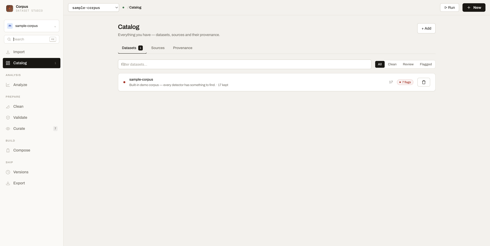
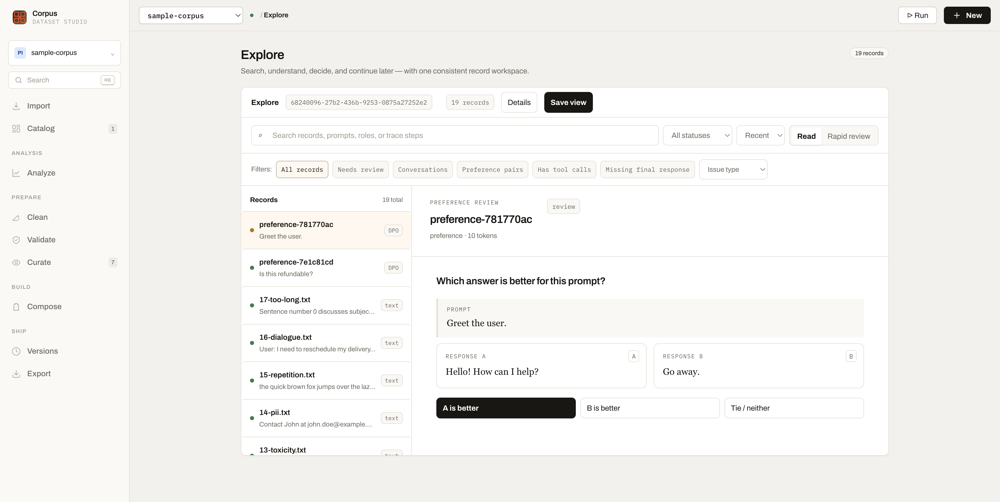
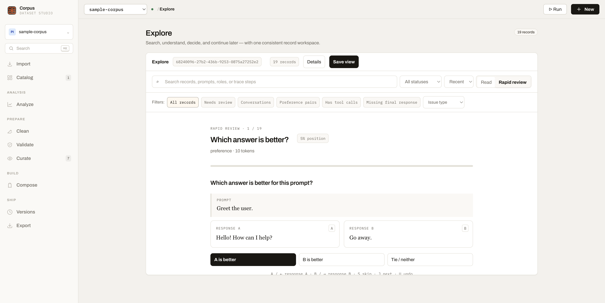
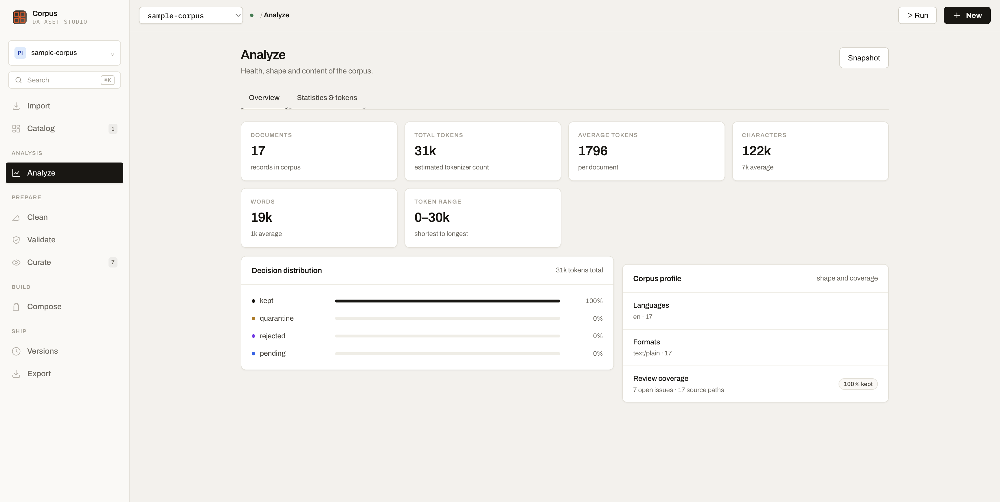
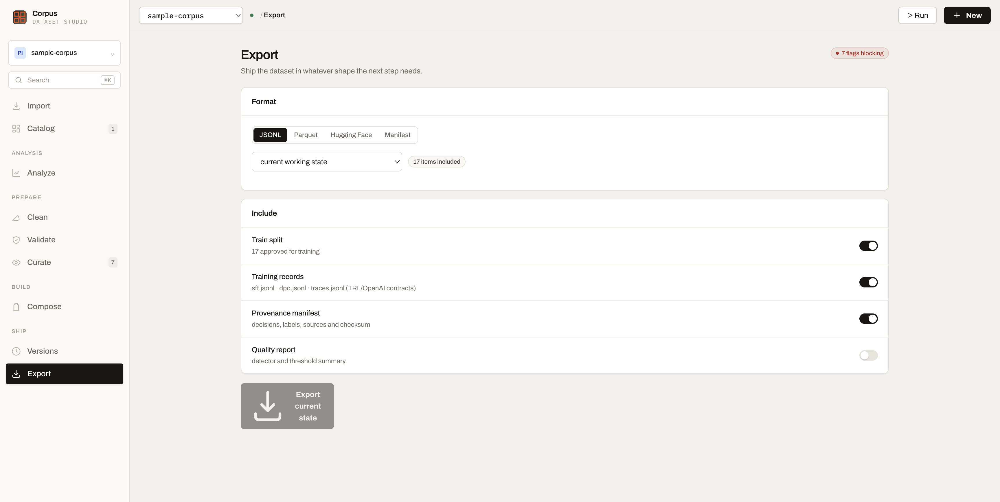

# LLM Dataset Studio

[](LICENSE)
[](https://github.com/artificialguybr/llm-dataset-studio/releases)

**Local-first tooling for curating text, conversation, SFT, DPO, and agent-trace datasets.**

LLM Dataset Studio helps you import data, understand its shape, find quality problems, review records, annotate examples, create versions, and export training-ready packages. It runs locally with SQLite. Source files stay untouched, automated checks produce inspectable evidence, and final decisions remain explicit.

It is a dataset curation studio — not a model-training framework.

## Product tour

### Catalog and provenance

Start with an empty workspace or load the built-in `sample-corpus` in one click. The Catalog keeps datasets, sources, counts, and provenance visible without hiding the local-first model.

<p></p>

### Unified Explorer

One consistent workspace handles plain text, instructions, conversations, SFT records, DPO preference pairs, and traces. Search, status, sort, and review actions stay in the same place while the reader adapts to the selected record.

<p></p>

Rapid review is available when a queue needs quick, keyboard-friendly decisions.

<p></p>

### Corpus statistics

Statistics and token metrics are combined into one view: document count, total and average tokens, characters, words, token range, language coverage, formats, sources, and decision distribution.

<p></p>

### Training-ready delivery

Exports include standard files for SFT, DPO, conversations, and agent traces, plus manifests, reports, and Hugging Face configuration files.

<p></p>

## Features

- Import JSONL, Parquet, TXT, folders, ZIP files, and Hugging Face datasets.
- Preserve source paths, original bytes, SHA-256 hashes, token estimates, metadata, licenses, and provenance.
- Review plain text, instruction records, multi-turn conversations, SFT messages, DPO pairs, and agent traces.
- Use a unified Explorer with Read and Rapid review modes.
- Review DPO pairs as response A/B comparisons without changing the normal record workflow.
- Filter trace-like data with signals such as `Has tool calls` and `Missing final response`.
- Validate language, repetition, size, spam, code, secrets, toxicity, safety, schema, and contamination.
- Find exact, near, and optional semantic duplicates.
- Keep reversible decisions: `keep`, `review`, `quarantine`, `reject`, and `restore`.
- Create labels, tags, preference decisions, derived datasets, samples, mixes, and splits.
- Create immutable versions with manifests, checksums, diffs, and restore support.
- Export JSONL, Parquet, Hugging Face datasets, manifests, split recipes, and audit reports.
- Use MCP or the REST/OpenAPI surface from an agent with explicit, auditable actions.

## Supported training formats

### Imports

The structured importer recognizes and deduplicates:

- OpenAI / TRL chat: `{"messages": [{"role": "user", "content": "..."}]}`
- ShareGPT: `{"conversations": [{"from": "human", "value": "..."}]}`
- Alpaca: `instruction`, optional `input`, and `output`
- TRL DPO: `prompt`, `chosen`, `rejected`
- Prompt-completion SFT: `prompt`, `completion`
- Agent/reasoning traces: `trace`, `steps`, `tool_calls`, `trajectory`, or `trace_type`

### Exports

Training exports include:

| Output | Contents |
|---|---|
| `sft.jsonl` / `sft.parquet` | OpenAI/TRL-style messages and prompt-completion records |
| `dpo.jsonl` / `dpo.parquet` | `prompt`, `chosen`, `rejected` preference pairs |
| `traces.jsonl` / `traces.parquet` | Flexible agent/reasoning trace payloads |
| Hugging Face configs | Dataset loading/configuration metadata |
| Manifest and report | Counts, source information, decisions, and export provenance |

Agent traces intentionally use a documented flexible JSON payload because there is no single universal trace standard.

## Requirements

- Python 3.11+
- [`uv`](https://docs.astral.sh/uv/)
- Node.js 20+ and npm, or [Bun](https://bun.sh/)
- macOS, Linux, or Windows

SQLite is the default local database. GPU support is optional and only needed for selected local ML providers.

## Install and run

```bash
git clone https://github.com/artificialguybr/llm-dataset-studio.git
cd llm-dataset-studio
python tools/setup.py
cp .env.example .env
python tools/start.py
```

Open <http://127.0.0.1:5199>. The API runs at <http://127.0.0.1:8766>.

On Windows PowerShell:

```powershell
py tools\setup.py
Copy-Item .env.example .env
py tools\start.py
```

### First run

The Catalog starts empty and offers **Load sample dataset**. It creates the built-in 17-item English `sample-corpus` and runs the available quality and duplicate checks. The same seed is available without the UI:

```bash
uv run python tools/seed_demo.py
```

## Providers and optional ML

The base installation stays lightweight. Install the ML extra only when semantic search or local embeddings are needed:

```bash
uv sync --extra ml
```

| Capability | Provider | Setup |
|---|---|---|
| Embeddings and semantic search | `sentence-transformers` | `uv sync --extra ml` |
| Text generation, pre-annotation, PII | OpenAI-compatible provider | API key plus model, or Ollama/vLLM via `IDS_OPENAI_BASE_URL` |
| Label quality | `cleanlab` | Install separately when needed |

Supported OpenAI-compatible endpoints include OpenAI, Ollama, vLLM, and compatible local gateways. Unsupported or unconfigured providers fail with an actionable error; the app never fabricates a result.

## MCP integration

The repository includes an experimental MCP stdio server for Claude Desktop, Cursor, local agent runtimes, and other MCP clients.

1. Start the Studio API.
2. Copy [`mcp-config.example.json`](mcp-config.example.json) and replace the absolute repository path.
3. Start the server from the repository root:

```bash
uv run python -m backend.mcp_server
```

The MCP adapter exposes:

- health and dataset discovery;
- unified Explorer search across text, conversations, SFT, DPO, and traces;
- item inspection and explicit text/conversation decisions;
- A/B preference decisions for DPO pairs;
- asynchronous jobs and job status;
- dataset exports.

Set `IDS_API_URL` when the API is not running at `http://127.0.0.1:8766`.

MCP is experimental in this release. It uses the same local REST API, validation, safety rules, and honest provider errors as the UI.

## Agent-ready workflows

The REST API, OpenAPI schema, unified Explorer envelope, and MCP tools are prepared for supervised agent workflows:

```text
inspect → filter → read evidence → propose → approve → decide → verify → export
```

Agents should not silently mutate decisions, run destructive-looking jobs, or claim results that the API did not return. Use [`docs/agent-playbook.md`](docs/agent-playbook.md) for the tool map, safe review loop, and example prompts.

Useful integration surfaces:

- OpenAPI: <http://127.0.0.1:8766/docs>
- ReDoc: <http://127.0.0.1:8766/redoc>
- Schema: <http://127.0.0.1:8766/openapi.json>
- Unified Explorer: `GET /api/datasets/{dataset_id}/explorer`
- Preference review: `PATCH /api/preference-pairs/{pair_id}/decision`

## Plugins and extensions

The repository ships source packs adapted to the text domain:

| Pack | Capabilities |
|---|---|
| `text-local` | sentence embeddings, pre-annotation, and local generation |
| `text-privacy` | deterministic email, phone, card, and secret detection |

Build platform-specific packs from tracked source:

```bash
uv run python plugins/build_packs.py --plugin all
```

Install from Settings → Extensions or `POST /api/plugins/install`. The runtime
validates paths, capabilities, permissions, process boundaries, timeouts, and
output shape. `text-local` uses the installed optional ML runtime and returns
an actionable dependency error when it is not installed.

## API

The FastAPI service is the complete integration surface. Endpoint groups cover datasets, imports, jobs, text/items, unified Explorer records, conversations, preferences, issues, duplicates, labels, versions, semantic search, derived datasets, exports, provider status/settings, model catalog, plugins, automation, and PII redaction.

```bash
curl http://127.0.0.1:8766/api/health
curl http://127.0.0.1:8766/api/datasets
curl 'http://127.0.0.1:8766/api/datasets/<DATASET_ID>/explorer?record_filter=preference'
```

## Development and tests

Backend tests:

```bash
uv run --with pytest pytest -q backend/tests
```

Frontend build:

```bash
cd frontend
npm run build
```

The test suite uses an isolated temporary data directory and does not pollute `data/studio.db`.

## Data safety and limitations

- Original source files are never rewritten by analysis or annotation jobs.
- Quarantine is reversible and does not delete source bytes.
- Dataset exports exclude quarantined items.
- Automated analysis creates issues or pending suggestions; a human makes the final decision.
- Import paths, ZIP members, and file access are validated.
- This is a local single-user application: authentication, multi-user permissions, and collaboration are outside scope.
- SQLite is the default storage backend; PostgreSQL and distributed workers are outside scope.
- Semantic search and clustering require the optional ML extra and suitable model resources.
- Cloud model inputs vary by provider/model; the configured model must support the common text-plus-prompt request.
- Cleanlab requires external class-probability data for label-quality analysis.
- The app prepares datasets for external training tools; it does not train models.
- MCP and plugins are experimental and should be evaluated before production automation.

## Repository layout

```text
backend/app/             FastAPI application, models, jobs, analyzers, providers, exporters
backend/tests/            Backend unit and contract tests
backend/mcp_server.py     MCP stdio adapter
frontend/src/             React application and visual system
docs/screenshots/         README product-tour screenshots
docs/agent-playbook.md    Supervised agent integration guide
tools/                    Setup, launcher, and sample-corpus seed
mcp-config.example.json   MCP client configuration example
pyproject.toml            Python dependencies and optional ML extra
.env.example              Safe configuration template
```

## License

MIT — see [LICENSE](LICENSE).
